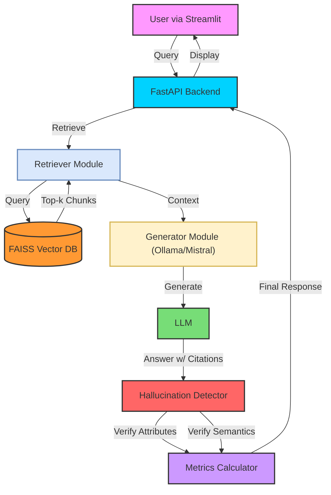

 # Hallucination-Aware RAG System 

> A production-grade Retrieval-Augmented Generation (RAG) system engineered to detect hallucinations, ensure transparency, and evaluate answer trustworthiness.

## Problem Motivation
Large Language Models (LLMs) are powerful but prone to **hallucinations**—generating plausible but incorrect information not supported by the retrieved context. In critical domains like legal, medical, or finance, these errors are unacceptable. 

This project solves this by checking the generated answer against the source documents using three distinct layers of verification: **Source Attribution**, **Semantic Similarity**, and **Claim Verification**.

## System Architecture

The system follows a modular microservice-like architecture separating retrieval, generation, and evaluation concerns.



##  Hallucination Detection Methodology

We implement a multi-stage verification pipeline:

1.  **Source Attribution Check**:
    *   **Logic**: Parses the answer for citation tags (e.g., `[Source 1]`) and verifies they map to valid retrieved documents.
    *   **Goal**: Ensures every claim is explicitly tied to a source.
    *   **Flag**: Highlights sentences lacking valid citations.

2.  **Semantic Similarity Validation**:
    *   **Logic**: Computes cosine similarity between the embedding of each answer sentence and the retrieved context chunks using `SentenceTransformers`.
    *   **Goal**: Detects "hallucinated" content that may be citated but is semantically unrelated to the source.
    *   **Threshold**: Sentences with similarity < 0.5 are flagged.

3.  **Metrics Calculation**:
    *   **Faithfulness**: Derived from semantic consistency.
    *   **Answer Relevance**: Similarity between Query and Answer.
    *   **Context Precision**: Relevance of retrieved chunks to the query.

## Getting Started

### Prerequisites

*   Python 3.10+
*   Ollama running locally with the `mistral` model:
    ```bash
    ollama pull mistral
    ollama serve
    ```

### Installation

1.  Clone the repository and install dependencies:
    ```bash
    pip install -r requirements.txt
    ```

2.  Create necessary folders (if not present):
    ```bash
    mkdir -p data results
    ```

### Running the System

You need to run the Backend and Frontend in separate terminals.

**1. Start the Backend API:**
```bash
uvicorn api.main:app --reload --port 8000
```

**2. Start the Frontend Dashboard:**
```bash
streamlit run app.py
```

### Usage Flow

1.  Open the Streamlit app (usually `http://localhost:8501`).
2.  **Ingestion**: Upload a PDF or TXT file via the sidebar. Click "Ingest".
3.  **Query**: Type a question in the main text box.
4.  **Analyze**: View the generated answer, check the **Hallucination Flags** (red/green highlights), and review the **Evaluation Metrics**.

##  Evaluation & Future Work

*   **Current Metrics**: Heuristic-based Faithfulness and Relevance.
*   **Limitations**: The current claim verification agent is simplified. 
*   **Future**: Integrate RAGAS framework for more robust "Deep Evaluation" using GPT-4 as a judge.

---
**Built with strictly typed Python, FastAPI, and Streamlit.**
